# Green Towers Web API

<h2 align="center">
  
</h2>

<h4 align="center"> 
	🚧  🚀 Em construção...  🚧
</h4>

 <a href="#-sobre-o-projeto">Sobre</a> •
 <a href="#-layout">Layout</a> • 
 <a href="#-como-executar-o-projeto">Como executar</a> • 
 <a href="#-tecnologias">Tecnologias</a> • 

## 💻 Sobre o projeto

O projeto Green Towers surge pela necessidade de uma aplicação que centralize a comunicação, necessidades e agendamentos entre os condôminos e o administrador do condomínio (API 24)

## Sobre a Aplicação

### Login

Ao entrar na aplicação temos a activity de Login, onde serão diferenciados os tipos de utilizador pelo e-mail e senha.

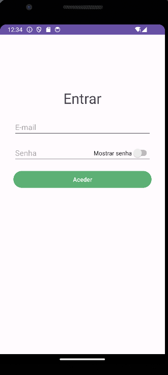

### Tipos de Utilizadores

Existem 3 tipos de utilizadores na aplicação, cada um com funcionalidades e interfaces diferentes:

- Morador: Pode fazer Reservas de áreas comuns, enviar Tickets ao Admin(para reporta um problema qualquer), visualizar os próprios tickets enviados, visualizar a resposta desses tickets, casos haja uma, visualizar os avisos globais, visualizar os avisos individuais destinados a esse morador e visualizar suas informações pessoais.
- Admin: Pode enviar avisos globais (a todos os moradores), avisos individuais(aviso destinado a somente um morador), responder tickets(efetuados por moradores), visualizar todas as reservas dos moradores e registar um novo Rececionista ou Morador.
- Rececionista: Pode ligar e desligar as Regas do condomínio através da aplicação, enviar um aviso individual, registar um visitante e visualizar a lista de todos os moradores.
 

### Morador a utilizar a aplicação

Após efetuar o login como um morador, temos a página inicial de morador, contendo uma listView dos avisos globais. Após carregar em um dos avisos, o morador é direcionado para uma activity contendo os detalhes daquele Aviso.
Na barra inferior da aplicação, temos 5 icones, que são respectivamente:
- Icone para a Página inicial (página atual)
- Icone para a Página inicial de Reservas
- Icone para a Página incial de Tickets
- Icone para a Página inicial de Avisos
- Icone para a Página de Perfil do Morador

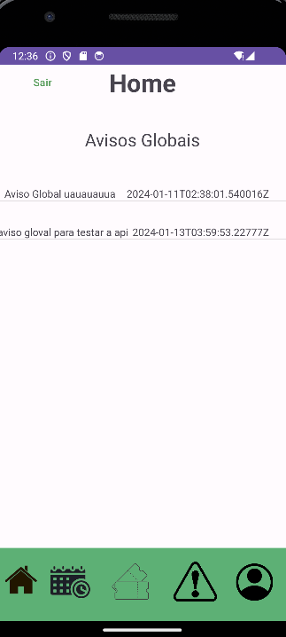

#### Página Inicial de Reservas

Clicando no botão minhas reservas, temos uma listView das reservas efetuadas. Clicando no botão nova reserva temos a opção de escolher piscina ou churrasqueira,
escolhendo um ou outro, um DatePickerDialog aparece na tela para escolhermos a data para qual queremos efetuar a reserva.

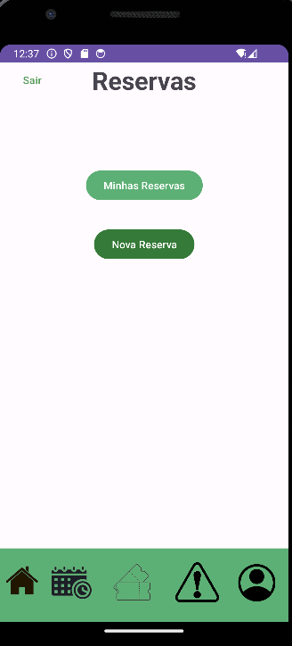

#### Página Inicial de Tickets

Clicando no botão meus tickets, temos uma listView dos tickets efetuados. É possível carregar no ticket para visualizar os seus detalhes (como se há ou não resposta daquele ticket). Clicando no botão novo ticket, é possível enviar um novo ticket para o admin.

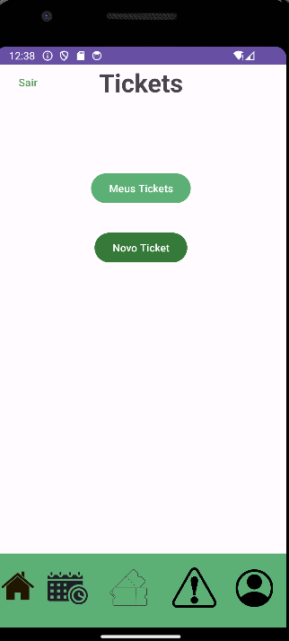

#### Página inicial de Avisos
Na página inicial uma listView dos avisos globais e uma dos individuais. Assim como nos tickets, é possível visualizar os seus detalhes carregando no item da listtView. 

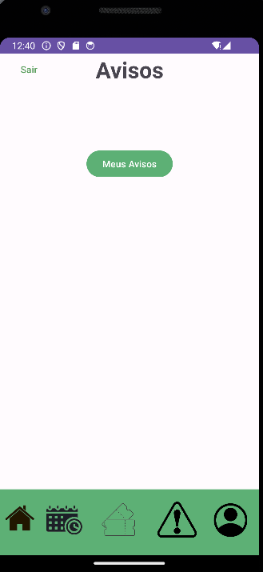

#### Página de Perfil do Morador
Clicando em cada botão, a respectiva informação aparece.

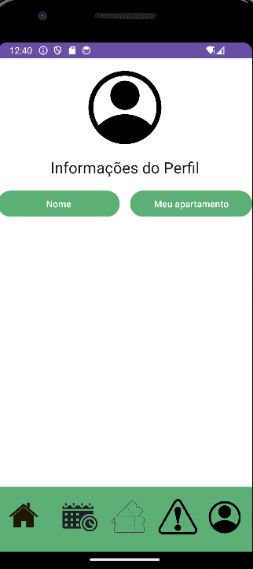

### Admin utilizando a aplicação

Após efetuar o login como um Admin, temos a página inicial de Admin, contendo uma listView das Reservas efetuadas por todos os moradores, e uma listView dos tickets não respondidos.
Na barra inferior da aplicação, temos 5 icones, que são respectivamente:
- Icone para a Página inicial (página atual)
- Icone para a Página inicial de Reservas
- Icone para a Página incial de Tickets
- Icone para a Página inicial de Avisos
- Icone para a Página sobre os moradores

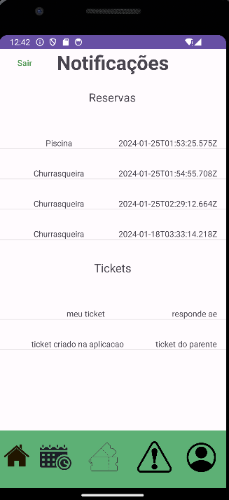

#### Página inicial de Reservas
Página contendo uma listView de todas as reservas efetuadas por todos os moradores

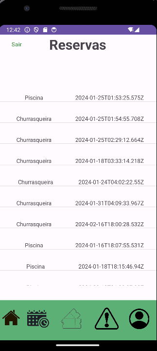

#### Página inicial de Tickets
Temos uma activity com duas listViews, uma de tickets não respondidos e outra com tickets respondidos. Clicando em ticket da lista dos não respondidos, somos redirecionados para uma página de resposta do ticket.

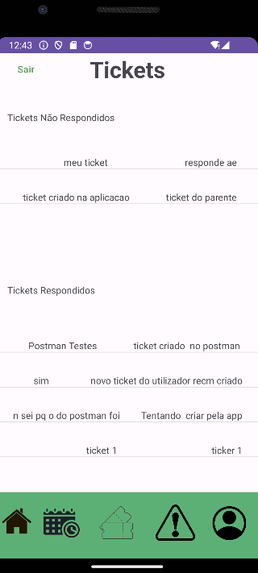

#### Página inicial de Avisos
Clicando em meus avisos, temos duas listViews, uma de avisos Globais e outra de individuais. Clicando em Novo aviso Global, somos redirecionados para uma página de criação de um aviso global. Clicando em Novo Aviso Individual, somos redirecionados para uma página de criação de um novo aviso global, onde se pode selecionar um morador com a lista de todos os moradores.

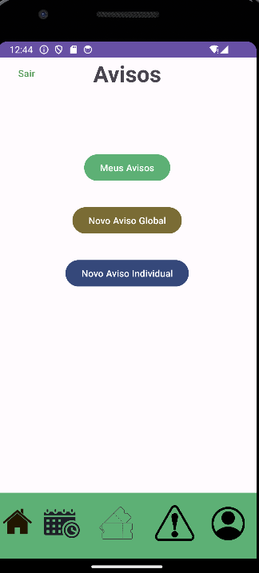

#### Página sobre os moradores
Nesta página é possível visualizar todos os Moradores registados e registar um novo utilizador após clicar no quinto icone(da esquerda para a direita)

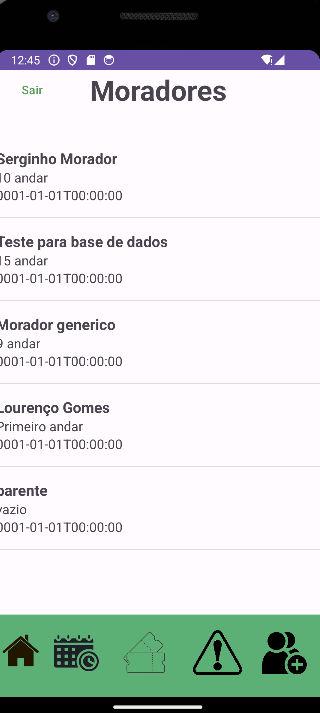

### Rececionista utilizando a aplicação
Após efetuar o login como um Rececionista, temos a página inicial das regas, contendo uma listView das Regas efetuadas, e um botão para ligar e desligar a rega.
Na barra inferior da aplicação, temos 3 icones, que são respectivamente:
- Icone para a Página das Regas (página atual)
- Icone para a Página inicial de Visitantes
- Icone para a Página incial de Avisos Individuais

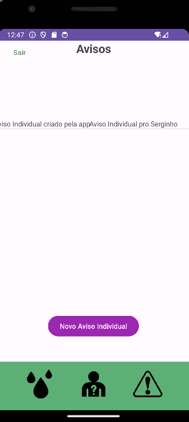

#### Página inicial de Visitantes
Temos uma listView de todos os visitantes já registados. Clicando em Registar Visitante, é possível registar um novo visitante.

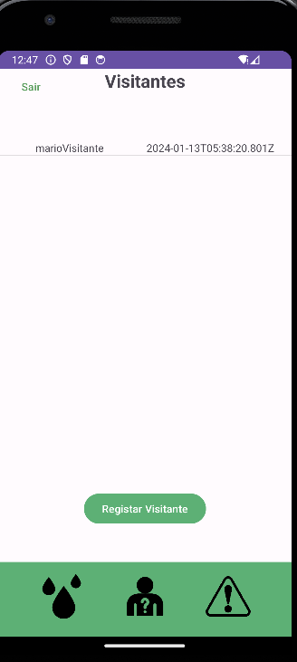

#### Página inicial de Avisos Individuais
Temos uma listView com todos os avisos individuais enviados e um botão para criar um novo aviso Individual (idêntico ao do Admin)

---

## 🎨 Layout

O layout da aplicação está disponível no Figma:

---

## 🚀 Como executar o projeto

### Pré-requisitos

Antes de começar, você vai precisar ter instalado em sua máquina as seguintes ferramentas:
[Git](https://git-scm.com), [Android Studio](https://dotnet.microsoft.com/en-us/download/visual-studio-sdks)

🧭 Rodando a aplicação web API

bash
Basta abrir o diretório da aplicação android e fazer build

---

## 🛠 Tecnologias

As seguintes ferramentas estão sendo usadas na construção do projeto:

- **[Kotlin](https://dotnet.microsoft.com/en-us/download/dotnet/8.0)**
- **[Android Studio](https://learn.microsoft.com/en-us/ef/)**
- **[Android](https://www.docker.com/)**
